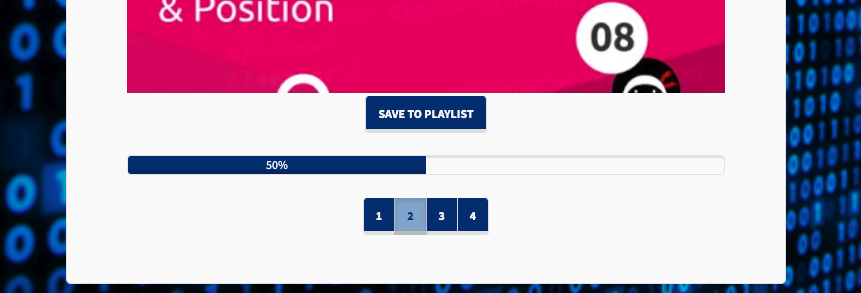
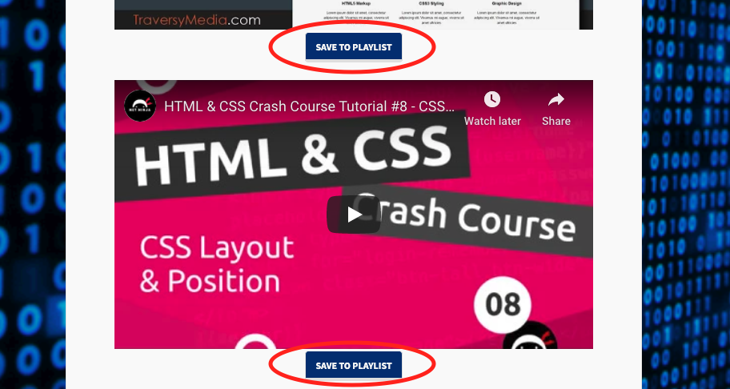

# CodeTube 

## Live Demo
[CodeTube](https://codetube-p2.herokuapp.com/)

## About
Website to access great online video tutorials when you are learning HTML for the first time. Create a login to begin accessing our curated playlist of the most helpful instructional videos by category. Save the videos that helped you the most and also search for your own to add and view later!

## User Story
AS A student learning HTML
I WANT to access a curated selection of video tutorials
SO THAT I can quickly locate/access/organize videos and learn content efficiently

## Usage 

 

#### Login Page
First Login to your account or go to next step to create a login 

#### Create Account
Create an account if you do not have one 
(insert create account page)

#### Members Pages: Curated Playlist
After loggin in you will arrive at the members page and are able to scroll thru our curated playlist that are sorted by categories of Basic, Layout and Styling

 
Scroll thru to view curated playlist: 

#### Members Pages: Saved Videos
Users are able to save their favorite videos for easy recall 
 
Save videos from curated list:

#### Members Pages: Search Youtube Videos
Users also have the ability to search youtube and find new videos

## Roadmap
Ideas we have to expand the app are:
* Ranking of videos
* Ability to search curated videos
* Expanding the categories beyond HTML adding JS, CSS playlist. 

## Authors 
[Mary Kathryn Holt](https://github.com/MaryKathryn0) 
[Wendy Grant](https://github.com/wkgrant78) 
[Christi Kerr](https://github.com/christinakerr) 
[Jacob Nelson](https://github.com/Jacobn88) 

